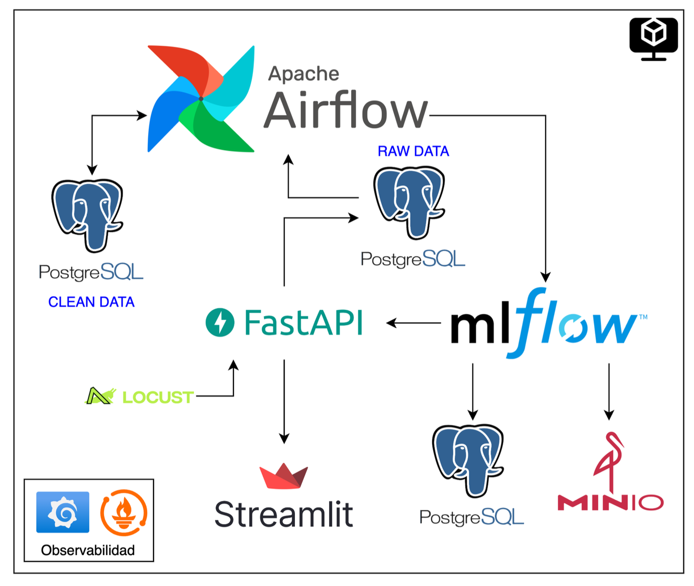
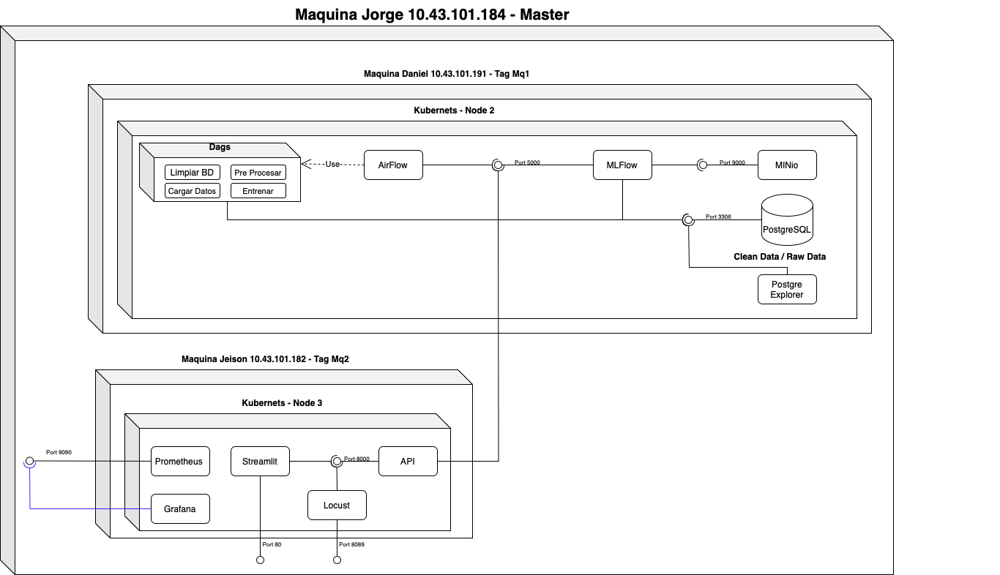
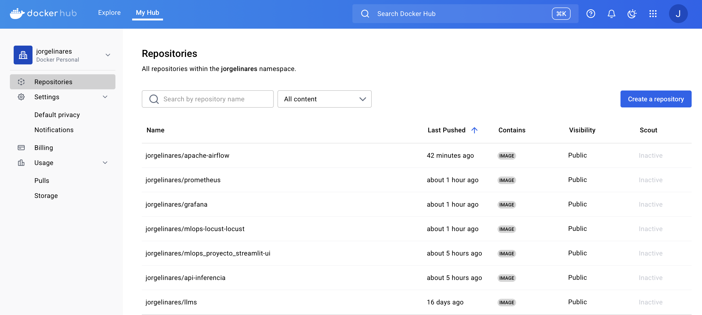
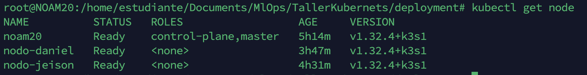
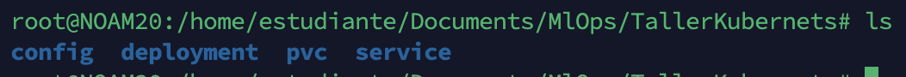
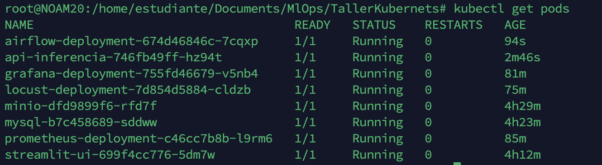
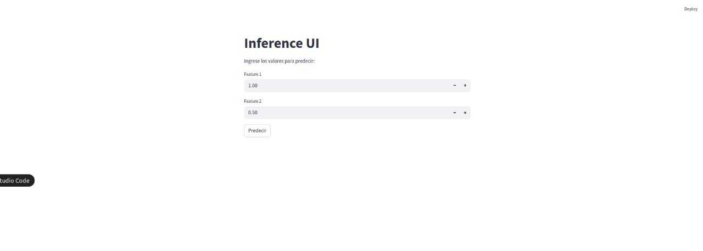

# MLOps-k8s
# Proyecto despliegue arquitectura Kubernets

Este proyecto es un sistema que permite tener un flujo limpio y automatico para el entrenamiento de modelos de ML y adicional en publicarlos a un ambiente productivo para que una api en este caso sea quien lo consuma

**La arquitectura solicitada es la siguiente**



**Solucion Presentada**

Para esta actividad contamos con 3 maquinas

- **10.43.101.184** Maquina de Jorge 
- **10.43.101.182** Maquina de Jeison
- **10.43.101.191** Maquina de Daniel

Y con esto proponemos la siguiente arquitectura




## Tecnologías Utilizadas

- **Python** Tecnologia utilizada para la creacion del api
- **Airflow** Tecnologia utilizada para orquestar los dags y dar manejo al entrenamiento de los modelos
- **Grafana** Tecnologia utilizada para el manejo y control de logs
- **Locust**  Tecnologia utilizada para realizar pruebas de carga sobre el **api**
- **Minio** Tecnologia utilizada para contener los modelos entrenados
- **Mlflow** Tecnologia utilizada para llevar las estadisticas de los modelos
- **Mysql** Tecnologia utilizada para persistir datos
- **Prometheus**  Tecnologia utilizada para obtener metricas del api
- **Streamlit**  Tecnologia utilizada para ejecutar su responsabilidad de frontend

## Docker hub

Utilizamos docker hub para contener todas las imagenes de las tecnologias mencionadas anteriormente, esto con el fin de personalizar cada imagen para la actividad requerida



## Implementacion

Una vez definida la arquitectura se procedio a instalar K3s en las 3 maquinas utilizando el siguiente comando:


```bash
curl -sfL https://get.k3s.io | K3S_URL=https://10.43.101.184:6443 K3S_TOKEN=K108d171d2fed096b8c59554ccd9e68e257b3ee2ac7040ce1e45c3c1297acb42372::server:73be5b885e76e005326f7fc508265e05 INSTALL_K3S_EXEC="--node-name nodo-jeison" sh -
```

con este comando ligamos los nodos a la maquina principal y le damos permiso de control del nodo para esto los nodos creados fueron los siguientes:



Una vez configurados los nodos todos los despliegues se realizan desde el control plane.

Por eso creamos estructura de despliegues utilizando las siguientes carpetas

## 📁 Estructura del Proyecto

```
├── config/       # Archivos de configuración (ConfigMaps, variables de entorno, etc.)
├── deployment/   # Definiciones de despliegue (Deployments, ReplicaSets)
├── pvc/          # Volúmenes persistentes (PersistentVolumeClaims)
├── service/      # Servicios (ClusterIP, LoadBalancer, NodePort)
```



## 📦 Carpetas

### 🔧 `config/`
Contiene archivos YAML para la configuración general de la aplicación. Ejemplo:

```yaml
# config/configmap.yaml
apiVersion: v1
kind: ConfigMap
metadata:
  name: app-config
data:
  APP_ENV: "production"
  LOG_LEVEL: "debug"
```

### 🚀 `deployment/`
Define cómo se despliega la aplicación. Ejemplo:

```yaml
# deployment/deployment.yaml
apiVersion: apps/v1
kind: Deployment
metadata:
  name: my-app
spec:
  replicas: 2
  selector:
    matchLabels:
      app: my-app
  template:
    metadata:
      labels:
        app: my-app
    spec:
      containers:
        - name: my-container
          image: my-image:latest
```

### 💾 `pvc/`
Gestión del almacenamiento persistente. Ejemplo:

```yaml
# pvc/pvc.yaml
apiVersion: v1
kind: PersistentVolumeClaim
metadata:
  name: app-storage
spec:
  accessModes:
    - ReadWriteOnce
  resources:
    requests:
      storage: 1Gi
```

### 🌐 `service/`
Define cómo exponer la aplicación. Ejemplo:

```yaml
# service/service.yaml
apiVersion: v1
kind: Service
metadata:
  name: my-app-service
spec:
  type: ClusterIP
  selector:
    app: my-app
  ports:
    - port: 80
      targetPort: 8080
```

---

## 🚀 Cómo aplicar los manifiestos

```bash
kubectl apply -f config/
kubectl apply -f pvc/
kubectl apply -f deployment/
kubectl apply -f service/
```

---

## Ejecucion

Una vez todos los pods se han generado desde el control plane se ve lo siguiente



#Front end
Cuando ejecutamos la aplicacion se ve de la siguiente manera


